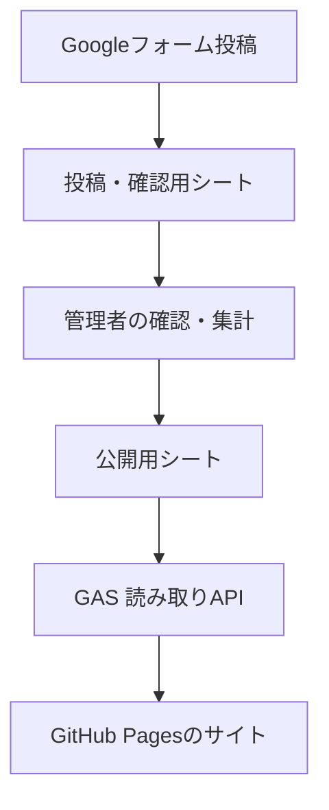

# KP集計サイト 要件定義書（v0.3）

最終更新: 2026-07-18

## 1. 目的

ポケットモンスター エメラルド（第3世代）の大会について、参加者の使用ポケモンと「KP（かぶりポイント）」を、誰でも見やすく確認できる非営利の公開サイトを作る。

参加者が自分の使用パーティを投稿し、管理者が大会単位で確認・集計してから公開する。閲覧サイトは静的ホスティングで無料運用する。

## 2. MVP（最初に公開する範囲）

### 利用者

| 利用者 | できること |
| --- | --- |
| 閲覧者 | 大会一覧、各大会の集計結果、参加者名による検索を閲覧する |
| 投稿者（大会参加者） | Googleフォームから自分の使用パーティを投稿する |
| 管理者 | 投稿を確認し、公開用スプレッドシートへ集計済みデータを登録・修正する |

### 画面

1. **大会一覧画面**
   - 大会名、開催日、参加人数、ルール概要を一覧表示する。
   - 大会を選ぶと集計結果画面へ遷移する。
   - 最初は開催日の新しい順。将来、世代・ルール・主催者で絞り込めるようにする。

2. **大会集計結果画面**
   - 大会情報（大会名、開催日、ルール、参加人数、結果の注記・リンク）を表示する。
   - 大会の参加人数と、KP・使用率の集計対象人数（有効なパーティ提出者数）を区別して表示する。
   - ポケモンごとのKP（使用人数）・使用率を表で表示する。
   - ポケモン画像、名前、KP、使用率でソートできる。
   - 参加者ごとの順位（任意）と使用ポケモン6匹を投稿順で表示する。
   - ポケモン画像は手元で用意するJSONと画像を使い、外部画像URLに依存しない。

3. **ユーザー検索画面**
   - 表示名の部分一致で検索する。
   - ユーザーごとに、掲載されている大会・順位（ある場合）・使用ポケモン6匹・パーティKPを表示する。
   - 検索・表示は `user_name`（表示名）のみで行う。同名の人がいた場合は同じ検索結果に並ぶ。

4. **投稿フォーム（サイト外）**
   - Googleフォームを利用する。
   - 投稿者は大会参加者本人を想定する。
   - 必須候補: 大会名、参加者名、使用ポケモン6匹。順位・補足は任意とする。
   - 大会の結果や順位は、管理者が別の出典を確認して補うこともできる。
   - フォーム投稿は**公開データではない**。管理者の確認後にのみサイトへ反映する。

## 3. KPの定義

このサイトでは、KPを「大会内でのそのポケモンの使用人数」と定義する。

- 大会内のあるポケモンの使用人数を `n` とする。
- そのポケモンのKPは `n` とする（1人だけが使ったポケモンは1KP）。
- 各参加者のパーティKPは、採用した6匹のKPの合計とする。
- 例: 参加者6人中4人が使ったポケモンのKPは4。そのポケモンを採用した各参加者のパーティKPには4を加算する。
- エメラルドの通常ルールでは同一パーティ内に同種ポケモンを重複させない前提とする。ニックネーム・性別は同じポケモンとして集計する。欠場・不明枠の扱いは別途決める。

> サイト内には、この計算式と使用率の分母を常に掲載する。

## 4. データの扱い

### 情報源と公開フロー

- 投稿・連絡先・管理メモは公開用シートに入れない。
- GASは公開用シートだけを読み取り、登録・更新APIは作らない。
- フロントエンドは取得したJSONだけを表示し、スプレッドシートを直接公開しない。

### 公開用スプレッドシート案

データを手入力・確認しやすくしつつ、API側で安定して返せるように、次の3シートに分ける。

#### `tournaments`

| 列 | 内容 |
| --- | --- |
| tournament_id | URLにも使う不変のID。例: `emerald-2026-08-01-kp-cup` |
| name | 大会名 |
| held_on | 開催日（YYYY-MM-DD） |
| game | `emerald`（将来は世代・作品を追加） |
| rule_summary | ルールの短い説明 |
| participant_count | 大会の参加人数。棄権・パーティ不明者も含む |
| source_url | 結果・告知などの出典URL |
| note | 注記 |
| published | `TRUE` の大会だけ公開 |

#### `entries`（1参加者 × 1大会）

| 列 | 内容 |
| --- | --- |
| entry_id | 一意なID |
| tournament_id | `tournaments` と紐付けるID |
| user_name | サイトに表示する名前 |
| placement | 順位。未確定なら空欄 |
| pokemon_1 ～ pokemon_6 | ポケモンの実名（例: `ボーマンダ`）。ポケモンJSONのIDは保存しない |
| note | 公開してよい補足 |

`entries` シートの行順を投稿順として扱い、順位がない場合のサイト表示にもそのまま使う。管理者がGoogleフォームの回答を整理して、重複・誤入力を除いた行だけを公開用シートへ登録する。

#### `pokemon_stats`（大会 × ポケモン）

| 列 | 内容 |
| --- | --- |
| tournament_id | 大会ID |
| pokemon_name | ポケモンの実名（`entries` と同じ表記） |
| usage_rate | 有効なパーティ提出者数を分母にした使用率（小数。例: 0.625） |
| kp | KP（使用人数） |

- MVPでは参加者本人がGoogleフォームから自分のパーティを投稿し、管理者が確認した内容を `entries` と `pokemon_stats` に転記する。
- 将来はGASの管理用スクリプトで `entries` から `pokemon_stats` を再計算できるようにする。ただし、公開読み取りAPIと管理処理は分離する。
- ポケモン画像を表示するときは、フロントエンドが `pokemon_name` を手元のポケモンJSONと照合して画像を取得する。フォーム・公開用シートでは表記ゆれを防ぐため、ポケモン名を候補選択式にする。

## 5. API要件

Google Apps Scriptをウェブアプリとして公開し、`GET` のみ提供する。

| エンドポイント例 | 用途 |
| --- | --- |
| `?resource=tournaments` | 公開中の大会一覧 |
| `?resource=tournament&id={tournament_id}` | 大会情報・ポケモン別集計・参加者パーティ |
| `?resource=users&q={検索語}` | ユーザー名の部分一致検索結果 |

- すべてJSONで返す。
- 大会詳細には、公式の `participant_count` と、`entries` の件数から求めた `valid_entry_count`（KP・使用率の集計対象人数）を含める。
- 存在しないIDは404相当のエラーJSON、必須パラメータ不足は400相当のエラーJSONを返す。
- シート列名とJSONのキーは英小文字スネークケースで統一する。
- フロント側でAPI失敗時の再試行案内と「データを取得できませんでした」を表示する。
- 最初に、GitHub Pages上のブラウザからGASの公開URLを認証なしで取得できること（CORSを含む）を検証する。成立しない場合は、公開JSONをGitHub Actionsで取り込んで静的ファイルとして配信する方式へ切り替える。
- 本番はGASの**バージョン付きデプロイ**を使い、テスト用URLと分ける。Apps Scriptのウェブアプリは`doGet`または`doPost`を実装して公開でき、一般公開にはバージョン付きデプロイが推奨されている。 [Google Apps Script: Web Apps](https://developers.google.com/apps-script/guides/web)

## 6. 技術構成の決定案

| 領域 | 採用案 | 理由 |
| --- | --- | --- |
| フロント | React + TypeScript + Vite | 静的サイトに向き、画面・検索・一覧の部品化がしやすい。Next.jsのサーバー機能は不要。 |
| UI | CSS Modules または素のCSS | 初期規模ではTailwind等の追加依存を増やさない。 |
| ホスティング | GitHub Pages | ビルド済みの静的ファイルを無料公開できる。 |
| データ | Google スプレッドシート | 小規模データを管理画面なしで更新できる。 |
| API | Google Apps Script | シートから公開用JSONを整形して返せる。 |
| 投稿 | Google Forms | まずはフォーム作成・回答確認を無料で運用できる。 |
| デプロイ | GitHub Actions | mainブランチへの反映でGitHub Pagesへ自動デプロイする。 |

## 7. 非機能要件

- **費用:** 無料枠のみ。広告・課金・収益化なし。
- **対応端末:** PC・スマホの両方。横幅320px以上を最低対象とする。
- **表示速度:** 初回表示で大会一覧をすぐ見せる。ポケモン画像は遅延読み込みする。
- **アクセシビリティ:** 画像に名前を含む代替テキスト、キーボード操作可能な検索・ソート、色だけに依存しない表示。
- **SEO:** 大会ごとに固有URLを持たせ、タイトル・説明・OGPを設定する。
- **運用:** 管理者がフォーム回答を整理して公開用シートへ登録する。重複投稿・誤入力はこの時点で除外する。シート更新後、サイト側で新しい結果を取得できる。反映遅延を利用者向けに明記する。
- **バックアップ:** 公開用シートは定期的にCSVまたはGoogleドライブ上のコピーを残す。

## 8. MVPで扱わないこと

- ログイン、ユーザー自身による編集・削除
- リアルタイムな自動集計・承認ワークフロー
- 対戦ログ・技構成・持ち物・個体値の詳細表示
- 複数世代・複数作品の横断ランキング
- SNS連携、コメント、いいね
- 収益化・広告

## 9. 実装順

1. KPの定義、集計対象、掲載ポリシーを確定する。
2. ポケモンJSONのID仕様と公開用スプレッドシートを作る。
3. GASで大会一覧・大会詳細の読み取りAPIを作る。
4. React + TypeScriptで3画面を作る（仮データで先に確認）。
5. APIと接続し、スマホ表示・エラー時の表示を確認する。
6. GitHub Pagesへ公開し、Googleフォームの導線を設置する。

## 10. 確定した運用ルール

1. `participant_count` は棄権者・パーティ不明者を含む大会の参加人数とする。
2. KP・使用率は、パーティが判明して公開用シートに登録された有効な提出者数から算出する。したがって、公式参加人数とは分母が異なる場合がある。
3. 順位がない・未確定の大会では、参加者を投稿順で表示する。
4. Googleフォームの回答は管理者が整理し、重複・誤入力を除いた状態で公開用シートに登録する。
5. 公開用シートのパーティ欄にはポケモンJSONのIDではなく、実際のポケモン名を保存する。
